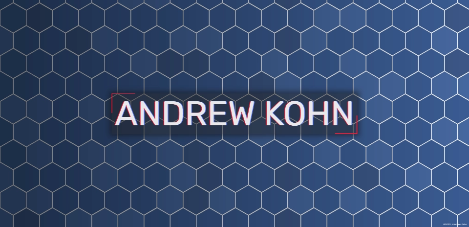

<h1 align="center">APK Portfolio</h1>

<h3 align="center">Andrew P Kohn</h3>

  <a href="https://apk-portfolio.netlify.app/" target="_blank">Portfolio Link</a>

<h2>About</h2>

This is my portfolio to help showcase projects and to get to know a little about me!

<h2>Lessons learned</h2>

I feel I went a little overboard with this project, but I didn't want to do another cookie-cutter minimalist top-down portfolio site.  At the start of the project, I got attached to the flex-grow idea of opening each section and went along with that.  After looking back, I wished I went with the mobile-first approach as I'm not too satisfied with the media queries in this project.

I really enjoyed working with JavaScript in this project, and so I created the starting hex screen with the html date element that shows the user's nearby location, weather, and date.  I could have opted for a simple button addEventListener(), or just removed the startup screen altogether, but I really wanted to perservere and try to utilize the ideas I had in mind.  One issue I encountered when working with the html date element was that the API I was using to get the user's nearby location actually had a limited amount of tokens, and that each time I refreshed or started up the live server, it would expend one use.  It was easily fixed by creating a new account as it was free to use.

<h2>Punch-list for the future</h2>

- [ ] Send a link automatically to my e-mail when api location tokens are getting low.
- [ ] Too RGB for my taste. Have a more pleasant color scheme.
- [ ] Re-work media queries to include height and orientation.
- [ ] Have better project pictures.

More to come.

  
  &nbsp;&nbsp;
  

